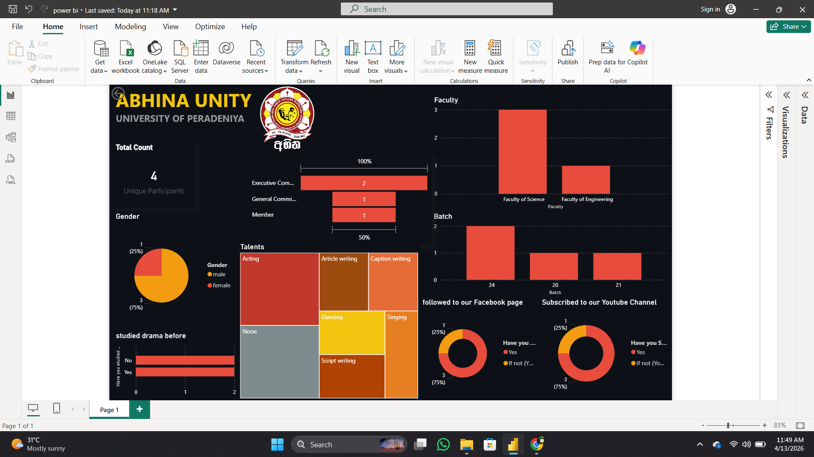
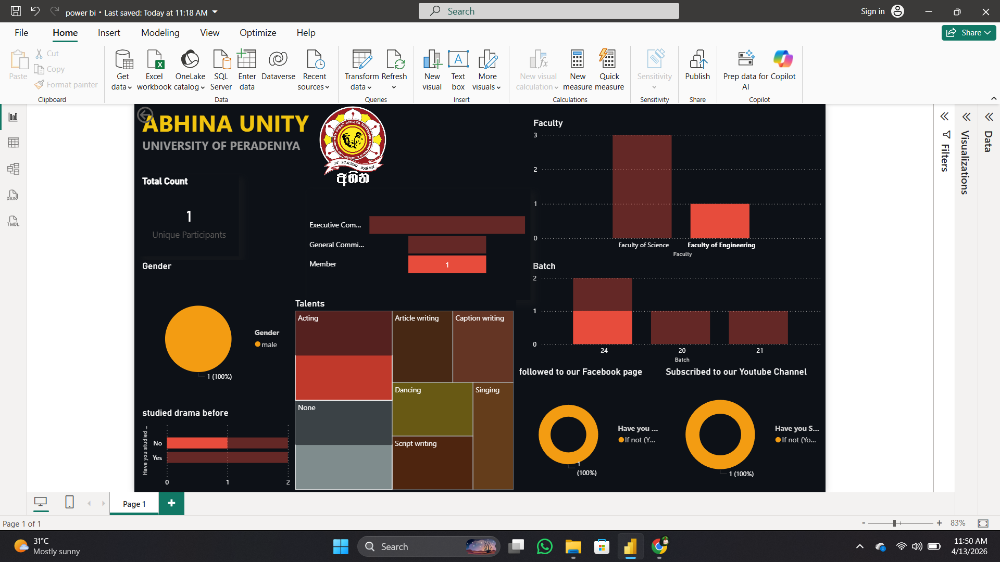
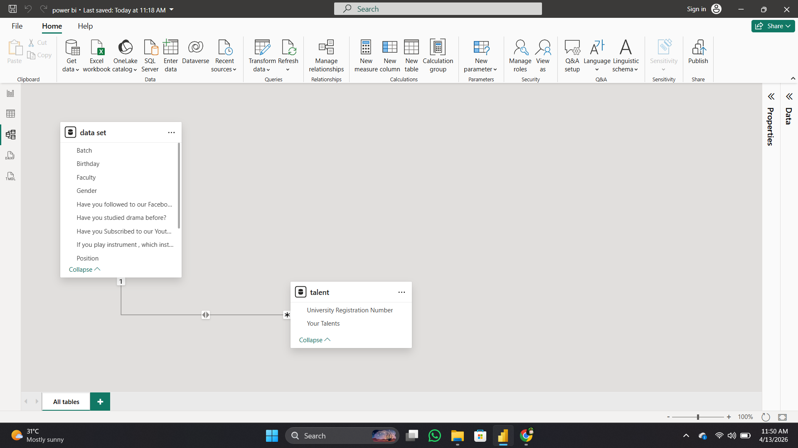

# Membership-Analytics-Dashboard---Drama-society-in-University-of-Peradeniya
A real-time Power BI dashboard for Drama Society in University of Peradeniya to analyze membership demographics, talent and engagement metrics using automated data sync.

# 🎭 Drama society - Membership Data Analytics Dashboard
This project is a real-time data analytics dashboard created by Power BI for the Drama Society at the University of Peradeniya. The dashboard provides deep insights into membership demographics, talents, and engagement metrics to improve decision-making.

# 📊 Dashboard Preview
## Dashboard Preview

## Model view

## Demo Video

https://github.com/user-attachments/assets/16483f7e-03c4-4703-9964-5379379f3153

# 🚀Key Features

* Real-time Data Sync: Connected to a live Google Form/Sheet. Data updates automatically upon submission.
* Advanced Data Modeling: Implemented a Reference Table strategy to handle multiple talents per user without duplicating core demographic data.
* Bi-directional Filtering: All charts interact seamlessly (Cross-filtering) to allow deep dives into specific faculties, batches, or talent groups.

# 🛠️ Technical Stack

* Data Source: Google Forms & Google Sheets.
* Tool: Power BI Desktop.
* Data Transformation: Power Query (M Language) for data cleaning and row-splitting.
* Calculations: DAX (Data Analysis Expressions).

 # 🧠 Data Modeling Logic

## To handle the "Your Talents" field (where one member has multiple talents separated by commas), I used the following approach:

Created a Reference Table named Talents_Data.
Applied Split Column by Delimiter (Comma) into Rows.
Established a One-to-Many Relationship between the main data and the talent table.
Enabled Bi-directional cross-filtering to ensure the Treemap can filter the entire dashboard.

# 🔑 Key DAX Measures

Code snippet

// Total Membership Count

Unique Participants = DISTINCTCOUNT('Data Set'[University Registration Number])

# 🛡️ Privacy & Security

All sensitive personal information (Contact numbers/Full names) has been anonymized or excluded from this public repository.

